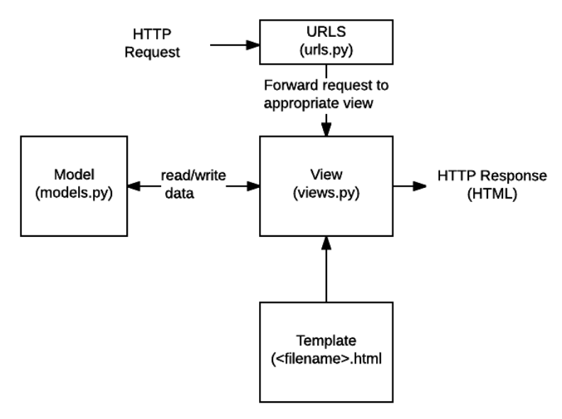

# greenhouse
We use the tried-and-true software stack of Apache, MySQL, and PHP, on both Windows 10 and Linux (Ubuntu 18.04). Below we have documented our progress, taking note of any software changes we have made down the line.
# setting up the server
## Windows
Install XAMPP with defaults. Change port of MySQL instance to 3007 if another MySQL instances is installed.
## Ubuntu 18.04
Run the command `sudo apt-get install apache2 mysql php`. Add a global `ServerName localhost` directive to the `/etc/apache2/apache2.conf`; file. Also add the following code to the bottom: 
```
<FilesMatch \.php$>
SetHandler application/x-httpd-php
</FilesMatch>
```
Then run the command `sudo a2dismod mpm_event && sudo a2enmod mpm_prefork && sudo a2enmod php7.2`. If your version of php is incorrect, run the command a2enmod and look through the list. Place files in the `/var/www/html/` directory.

## Semester 2
# Django
The website/ directory contains our server-side code written in the Django framework. The server can be started from within the website/ directory with the `python{3} manage.py runserver`. On initial startup, you can ignore the warning for unapplied migrations. This can be fixed by running the command `python{3} manage.py makemigrations`. Django introduces a view interface that routes urls to HTML pages, which is outlined below. 